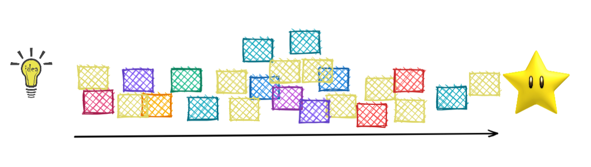
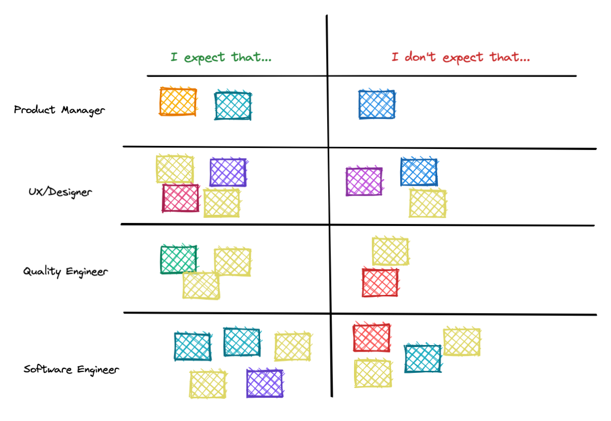

In the team that I work with, we run [retrospective
ceremonies](https://www.thoughtworks.com/en-au/insights/blog/5-things-you-need-know-facilitate-retrospective#:~:text=A%20Retrospective%20is%20a%20ceremony,evaluate%20its%20past%20working%20cycle.&text=Finally%2C%20retrospective%20is%20a%20moment,improve%20things%20identified%20as%20negative.)
every fortnight so that we can reflect on the work we've delivered by praising
our doings and see how we can improve our work or processes. Recently I had the
opportunity to run one of these meetings and this post is to share the format
I've used and how things went in general.

### Formats

I reckon that the most popular retrospective format is the triade _"What worked,
What we can keep doing and What didn't work"_ or any variation of that (i.e.
smile, sad and neutral faces, etc).

This format is great, but there are times where it can be quite challenging if
we want to touch on certain topics. For example, if I want to assess how aligned
we all are with regards to the role each one of us has to play in the Software
Development, how can I discuss that if all I have is "What worked", "What didn't
work", etc?

In our team, there are a quite diverse number of roles, which is actually true
in most of Software Development teams nowadays. We have people that are more
focused on the product direction, people that are looking into how the user
experience should be and Software Developers/Engineers like myself.

## How the activity went out

The retrospective was divided into 2 steps:

1. Bullet point gathering from each participant and then, translated them into
   sticky notes trying to form a timeline from the **Idea** to **Working Software**.
1. Asked the participants to fill out the **Roles and Expectations** matrix
based on the bullet points above.

#### First step: bullet points from Idea to Software lifecycle

The first step was to gather bullet points from everyoneasking **what are the
steps to deliver a software, starting from the idea until the actual software in
the hands of a customer**.

I wanted to avoid any kind of bias, so I did this **anonymously**.  Once I had
all the data from everyone, I've added sticky notes to represent the different
steps provided by everyone in some sort of timeline.

Here's an example:

#### Second step: fill out the "Roles and Expectations" matrix

The second step was to discuss more in-depth roles and expectations. To do that,
we created a matrix where the number of rows represents the many roles we wanted
to discuss and two columns saying **“I expect that...”** and **“I don’t expect
that…”**.  This idea was born from a combination of [Role Expectations
Matrix](https://www.funretrospectives.com/role-expectations-matrix/) and [Is -
Is not - Does - Does
not](https://www.funretrospectives.com/is-is-not-does-does-not/) exercises from
[FunRetrospectives](https://www.funretrospectives.com) website.

>[FunRetrospectives](https://www.funretrospectives.com) is an excellent source
>of different activities for running retros, so if you're looking for different
>activities to run in your team, please check them out!

For this activity, I asked each member to add sticky notes with a short summary
of what was the understanding of the expectation of each role, adding stickies
for **"I expect that..."** and also adding stickies for **"I don't expect
  that..."**. I also asked the participants to avoid the use of "+1" or any kind
  of emoji that would make others biased. The idea here was to have equal weight
  for every sticky note since we would have a **separate** moment for voting on
    the themes that we wanted to discuss and then, **"+1"'s** would be
    appropriate.

#### No action items, for now...

It is usually expected that **"Action Items"** should be one of the outcomes
from retrospectives and who owns these action items. For this retro though, I
wanted to focus on the **discussion** instead of focusing on action items.

I've planned having 45 minutes just debating the "Roles and Expectations" sticky
notes, appreciating **how different views we might have in the team about the
certain role and how we can agree on something together**. With that, I tried to
have 10 minutes time slot for the top voters, trying to cover as many roles as
possible.

### Takeaways from this particular retro

I've got feedback from the participants that the retro was quite insightful,
which inspired me to write this post. On the occasion of this particular retro,
as it might occur with many, there were some loose ends; **we couldn't figure
everything out in one go**. However, I believe we had an opportunity to speak
freely about what things some believed that a Software Engineer **should not
do**, for example, and appreciate that different people thought exactly opposite
  things.

## Thank you for reading

I hope you enjoy this post, if you have any feedback or questions, hit me up on
<alabeduarte@gmail.com>, I'd be happy to hear your thoughts and be better next
time!

_All the images were generated from [excalidraw.com](https://excalidraw.com/)_

### Other References

* [Retrospective
  Ceremony](https://www.thoughtworks.com/en-au/insights/blog/5-things-you-need-know-facilitate-retrospective#:~:text=A%20Retrospective%20is%20a%20ceremony,evaluate%20its%20past%20working%20cycle.&text=Finally%2C%20retrospective%20is%20a%20moment,improve%20things%20identified%20as%20negative.)
* [Role Expectations
  Matrix](https://www.funretrospectives.com/role-expectations-matrix/)
* [Is - Is not - Does - Does
  not](https://www.funretrospectives.com/is-is-not-does-does-not/)
