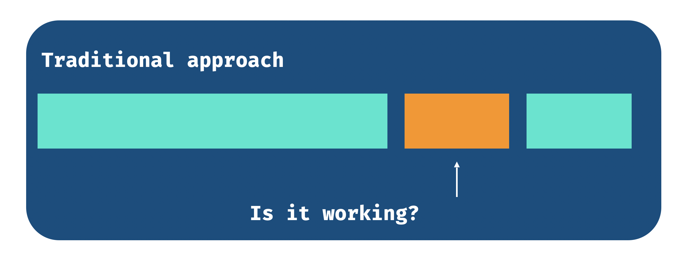
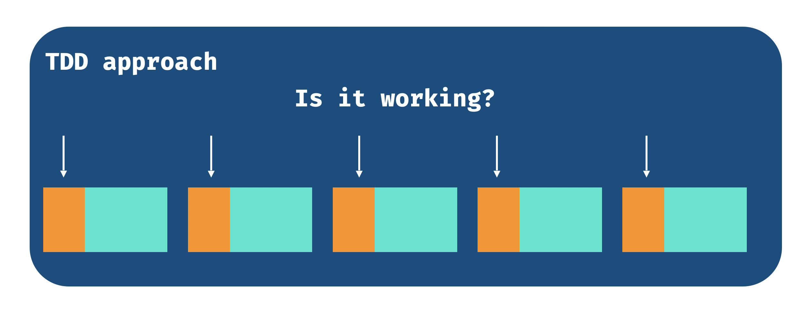

What is TDD? TDD stands for Test-Driven Development and it is a Software
Development's process that was credited to [Kent
Beck](https://www.kentbeck.com/).  The idea consists of writing unit tests for
your program, making them fail, then introducing the minimum amount of code that
is enough to make the test pass, then you continue writing more tests according
to your requirements at hand. By having tests in place, any change you do on
your main code (let’s call it production code from now) can be checked against
those tests and running them for every new change can be a way to get faster
feedback, as an alternative to boot your application (whatever that is), run by
each scenario and check if things are working as expected.

## My journey

TDD (Test-Driven Development) is one of many techniques for developing software
and this article aims to share my personal experience with it. I hope that I can
clarify my thoughts on **when I believe it can help** and when I believe we
should take a step back. I need to say that **I found TDD pretty difficult and
abstract at first**. There will always be a space for discussion and that’s why
other processes such as pair-programming and code review are extremely
complementary to what I consider healthy software development processes. Let me
give you some context before I start, so then you can understand better where I
came from.

I’ve started reading about TDD on the internet and what helped me the most in my
first steps were the articles from the [Caelum](https://www.caelum.com.br)
website. I found really nice examples of how to do it at the time through their
articles and further I found [books](https://alabeduarte.com/) which led me to
the formal definitions written by Kent Beck. Then I joined
[ThoughtWorks](https://www.thoughtworks.com) in 2011 and there I believe it was
a turning point for me. ThoughtWorks is famous for its revolutionary mindset
(look for [the agile manifesto](https://agilemanifesto.org)), the [Tech
Radar](https://www.thoughtworks.com/radar) publications and for caring about
code quality. However, the reason I believe working there was so important was
because of the people that I had a chance to work with at the time. They really
encouraged me to challenge the current state of the code and how it could be
improved. We also had a strong pair-programming culture which combined with
writing tests, challenging code maintainability became pretty natural.

## Why do I believe TDD is important?

### Test-Driven Development enables refactoring.

As I mentioned above, having tests that exercise your code’s intention (function
or method) opens room for refactoring the code with stronger confidence. You can
move stuff around, you can rename things that express better what you are trying
to do, you can add an argument to a function or you can remove them all. If
after all of that you run your tests and they pass, chances are that you’ve done
everything right! The opposite is true as well. If you change things and after
running the tests some of them fail, it could be a sign that you’ve done
something wrong and needs to be fixed. While refactoring the code, if you notice
that one single change affects multiple tests, it could be a sign that the
coupling between components is high or the scope of the change/refactor is big.

With time, **I learned that TDD is not about testing first necessarily**. The
process of writing tests first, seeing them fail to then make them pass to be
able to refactor really helps but the key factor to me was let the tests drive
how I think so that my scope of changes can be expressed in the tests. I might
want to refactor something, but if my scenarios are pretty small, I can postpone
this decision for later.

### Test-Driven Development favours design

TDD is all about letting your tests guide you about the problem you need to
solve. It is pretty common to use the baby steps terminology here. Basically,
you will start with really small and basic scenarios (for a given input, I
expect this output). With that in mind, your code design should be simple enough
to satisfy the requirements. Another aspect that can contribute to better design
is that your test is the first consumer of your code. There you will call the
function that you carefully named and thoroughly added certain arguments and you
will see if that really expresses what you want to do. You may ask: “Should I
really pass 4 arguments in here?” “Is this name good?” “Isn’t too complicated to
set up the initial state for just testing if this does what it needs to do?” If
the answer to this question doesn’t feel quite right, you can use this
opportunity to change your code and look at your unit tests again and imagine:
“how will someone call this code in real life? Is it easy to read?”.

Sometimes, “For a given input, I expect this output” is not possible.  You could
argue that it is not that simple as sometimes it is not easy to structure input
and expected output. However, The fact that might not be possible all times
doesn’t change the fact that you can always think about it and make it as an
exercise. Challenge yourself often and see if this is really the case. If not,
try breaking down your code into smaller components and then ask this question
again.

### Good code design is pretty subjective!

YES! That is it! If I’m coding all by myself I’m pretty sure I’ll understand it
all and every decision will make sense until I have to explain to someone.
That’s how pair programming and/or code review becomes crucial here. The process
of doing TDD evolves empathy as well. I tend to think that we need to solve some
problems right away, but often when I share my thoughts with someone I realise
that I’m thinking too far ahead. Conversations like that can help you to avoid
overengineering and make decisions prematurely. As we know by now, our tests are
the first consumers of our code, so lean on that and discuss with your peers
whether this is really a good design. Here are some questions that I often try
to ask myself:

* [x] Is my code easy to maintain?
* [x] Is my code easy to change?
* [x] Is my code easy to read?
* [x] Is my code expressive enough?

### TDD doesn’t mean bug-free code!

I’ve heard an argument before saying that if you’re doing TDD, your code
shouldn’t have bugs. Well, I believe this is a bold statement. Of course, my
code can have bugs. Test-Driven Development is a technique that requires
discipline and experience. If I don’t follow the steps, for example, if I never
see my tests failing, I can fall into the false positive trap. It is crucial to
write a test, see it fail, then make it pass! The tests should also be reliable.
Is part of the good design I mentioned above that our tests are also easy to
read and maintain. They should be predictable and clean. If there are too many
dependencies or setups, it could be a sign that my code is too coupled,
therefore, it will be hard to maintain and false positives can be introduced.
Besides, at this stage, you could argue if having tests is really adding value
given the amount of setup that it might require if you come to that point.

There is another aspect to it, which is: we still can write tons of unit tests
following all the rules, but with the wrong assumptions. If we don’t understand
the problem we are trying to solve, we will end up having tests that will
exercise something that doesn’t make sense with tests passing.

### Tooling

In the previous sections, I’ve described techniques, beliefs and discipline. To
make it stick and be pleasant, we need to have good tooling. The tests should be
fast to run. It should be quicker to run a test than open the application (i.e.
browser or mobile device) myself and test it out. While coding, it should be
quick to trigger the tests as well. Nowadays, most programming languages'
ecosystems contain some tool where it watches your code and whenever you save a
file, the tests relevant to that file will run. That is the sweet spot, in my
opinion.

### Final thoughts and when doing TDD doesn’t help

I believe that Test-Driven Development doesn’t help when we are not quite
certain about what to do and what to expect. Sometimes, you might not be
familiar with the language, framework or platform and you might need some time
to play around with the available APIs and see what it is possible and what can
be a constraint.

As the expected outcome might be unknown, having the development guided by tests
can be extremely difficult since TDD is all about defining the expectations and
figuring out how to meet them. So what usually works well for me is to do quick
experiments, writing code with no tests at all, see what can be done, explore
the limits of the tool/platform/API and then restart with TDD mindset using the
experiments as a reference/documentation. After that, I can safely throw the
experiment away and continue with the new code.

Of course, this might not work for everyone, but as I mentioned a few times, it
is all about the exercise. If you try to do that, you might learn a thing or two
and next time you will perform better. All I want is the short feedback and the
ability to iterate over my understanding of the problem at hand often.

### References

* [Agile Manifesto](https://agilemanifesto.org)
* [Test-Driven Development by
  Example](https://www.amazon.com.au/Test-Driven-Development-Kent-Beck/dp/0321146530)
* [Growing Object-Oriented Software, Guided by
  Tests](https://www.amazon.com.au/Growing-Object-Oriented-Software-Guided-Tests/dp/0321503627)
* [Test-Driven Development: Teste e Design no Mundo Real (Portuguese
  Edition)](https://www.amazon.com/Test-Driven-Development-Teste-Design-Portuguese-ebook/dp/B00WKMN24W)
