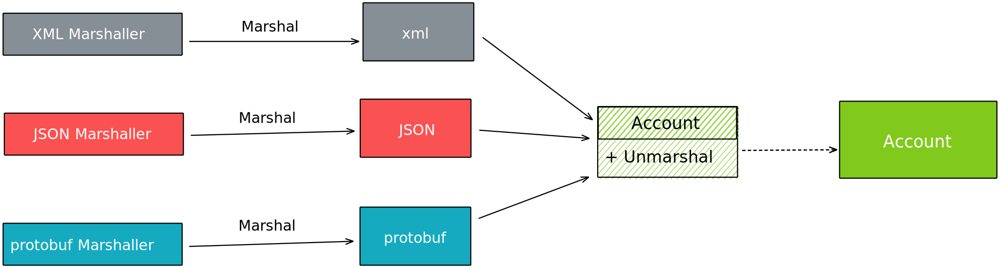
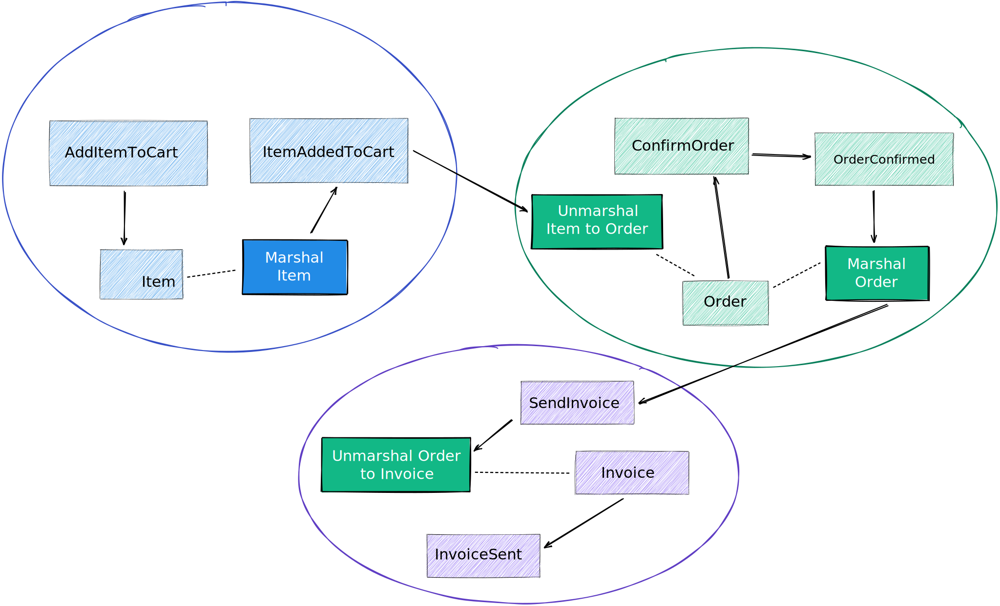

In this post, I'd like to discuss how Marshalling/Unmarshalling process is
usually applied in [Go](https://golang.org/) programs. I'll give some examples
of how it is used in practice with some code examples (i.e. data parsing) and
then expand on other usages when we have the need for transforming data across
different domains.

Before discussing the term
[Marshalling](https://en.wikipedia.org/wiki/Marshalling_(computer_science)), I'd
like to start with the word _data_ in the context of programming languages. More
often than not we programmers have a task that involves in some shape or form
interacting with data represented in a format and then we need to transform this
data into a different representation.

A few use-cases that come to mind:

---

> Fetch data from this HTTP API and convert it into my own type to then do
> something...

---

> As soon as this "data" arrives, transform them into something else, which is
> what our system understands...

---

> In order to integrate with certain third-party API, I need to convert this
> "data" into something that the third-party API understands to then send the
> data...

### What should we call this?

When it comes to changing data's representation into another representation in
Software, I would imagine some of these terms would ring a bell:
_Encode/Decode_, _Marshal/Unmarshal_, _Map_, _Normalise (also Normalize)_,
_Parse_, _Reduce_, _Serialise (also Serialize)_, _Transform_, _etc._

You might notice that different programming languages use one more than another
and, in Go, the terms `Marshal` and `Unmarshal` are usually preferred. In this
post, I'd like to explore or try to guess why this is the case and what all of
these terms have in common.

## The term Marshalling

In the context of computer science and programming languages, the term
_marshalling_ is the process of transforming a data representation into a
suitable format that will be used by a different Software Component.

This process is quite interesting because it enables interoperability between
different Softwares. Consider _Software X_ and _Software Y_, they are totally
independent of one another. However, they can communicate with each other via
message passing and they can exchange data, as long as they establish a common
contract or [interface](https://en.wikipedia.org/wiki/Interface_(computing)).

i.e.

```
Software X –> Marshal data "abc" into "<abc>"
Software Y –> Unmarshal data "<abc>" into "A, B, C"
```

## How Marshal/Unmarshal can be used in Go

In Go, one of the most famous examples you might find is converting data from a
JSON structure into Go code (_in other words, JSON "parsing"_).

>What about the term Parsing?

There is a quite popular term that can be seen as _similar_, but don't assume
that just yet, which is [parsing](https://en.wikipedia.org/wiki/Parsing). I
would say that the **semantics of parsing** is more applicable when the data to
be processed are ***strings/symbols*** that will then be transformed into a
custom representation throughout the programming language in question.

While terms like Marshalling and Encoding offer a bit more scope to work with.
Given you need to transform _type A_ to _type B_ while _type A_ is a **binary**,
I personally think that calling a "parser" doesn't feel right.

### Back to Marshalling and Unmarshalling

It took a bit longer but the term "Marshalling" clicked for me, eventually. When
I first came to learn Go, call the method `Unmarshal` to "parse" JSON felt
really weird and too much low-level.

However, Marshal/Unmarshal can and should be used as a generic way to transform
types between boundaries regardless of the level of abstraction (i.e. network,
application, domain, platform).

### Converting from one format to another

When dealing with [Distributed
Systems](https://en.wikipedia.org/wiki/Distributed_computing), converting
different representations from one domain to another can be quite common. And
I'm not only referring to business domains (i.e. Shopping cart, Billing,
Invoice) but also to different transport layers (i.e. Network, Protocols).

#### Data format transformations (i.e. JSON, XML, etc)

We can unmarshal from _type A_ to _type B_ when transporting data over
the wire or when converting from a generic data representation to a
domain-specific representation.

So let's imagine we are building a system that manages user's accounts and we
have the following use-cases to cover:

* Convert from [XML](https://www.w3schools.com/xml/xml_whatis.asp)
* Convert from [JSON](https://www.json.org/json-en.html)
* Convert from [Protocol Buffers](https://developers.google.com/protocol-buffers)
* etc.



### Code examples

<details>
<summary>Unit tests (click to expand)</summary>
<p>

```go
func Test_Unmarshal(t *testing.T) {
	tests := []struct {
		name string
		in   interface{}
		out  Account
	}{
		{
			name: "should unmarshal Account from XML",
			in: []byte(`
			<?xml version="1.0" encoding="UTF-8"?>
			<User>
				<Name>Mary</Name>
				<Type>Gold</Type>
			</User>
			`),
			out: Account{
				Name: "Mary",
			},
		},

		{
			name: "should unmarshal Account from JSON",
			in: []byte(`
			{
				"user": {
					"name": "John",
					"type": "Premium",
					"created_at": "2020-01-01"
				}
			}
			`),
			out: Account{
				Name: "John",
			},
		},

		{
			name: "should unmarshal Account from protobuf",
			in: ProtobufAccount{
				AccountName: "Bob",
			},
			out: Account{
				Name: "Bob",
			},
		},

		{
			name: "should not unmarshal from CSV format since it doesn't support yet",
			in:   []byte(`Name,Mary`),
			out:  Account{},
		},

		// ...
	}

	for _, tt := range tests {
		t.Run(tt.name, func(t *testing.T) {
			var a Account
			err := a.Unmarshal(tt.in)
			if err != nil {
				expectedError := fmt.Errorf("unable to unmarshal %v, format not supported.", tt.in)

				if err.Error() != expectedError.Error() {
					t.Errorf("unexpected error while trying to unmarshal account: %v", err)
				}
			}

			if tt.out != a {
				t.Errorf("test failed. wanted: %v, got: %v", tt.out, a)
			}
		})
	}
}
```
</p>
</details>

<p></p>

<details>
<summary>Implementation (click to expand)</summary>
<p>

```go
// xmlPayload represents the XML payload with user data
type xmlPayload struct {
	Name string `xml:User>Name`
}

// jsonPayload represents the JSON payload wiht user data
type jsonPayload struct {
	User struct {
		Name string `json:"name"`
	} `json:"user"`
}

// ProtobufAccount represents a generated Go code from a protobuf definition
// More details: https://developers.google.com/protocol-buffers/docs/reference/go-generated
type ProtobufAccount struct {
	AccountName string `protobuf:"bytes,1,opt,name=acount_name,proto3"`
}

// Account is the domain representation of an account in the system. It is the
// main entity for the example we're using.
type Account struct {
	Name string
}

func (a *Account) unmarshalXML(src []byte) error {
	var res xmlPayload
	err := xml.Unmarshal(src, &res)
	a = &Account{
		Name: res.Name,
	}
	return err
}

func (a *Account) unmarshalJSON(src []byte) error {
	var res jsonPayload
	err := json.Unmarshal(src, &res)
	a = &Account{
		Name: res.User.Name,
	}
	return err
}

func (a *Account) unmarshalProtobuf(src ProtobufAccount) error {
	a = &Account{
		Name: src.AccountName,
	}

	return nil
}

// Unmarshal takes an interface{} and try to convert into Account type
func (a *Account) Unmarshal(src interface{}) error {
	switch src.(type) {
	case []byte:
		b := src.([]byte)

		// naive logic to determine if it is XML
		if strings.Contains(string(b), "<?xml") {
			return a.unmarshalXML(b)
		}

		// naive logic to determine if it is JSON
		if strings.Contains(string(b), `"user":`) {
			return a.unmarshalJSON(b)
		}
	case ProtobufAccount:
		return a.unmarshalProtobuf(src.(ProtobufAccount))
	}

	return fmt.Errorf("unable to unmarshal %v, format not supported.", src)
}
```

</p>
</details>

### Converting from one domain to another

In this particular case, let's imagine we have an e-commerce system that goes
from adding item to a cart, placing an order and sending an invoice to the
customer.

Once the customer selects an item and adds it to her/his cart, the item will be
part of an order that will also be listed in the invoice afterwards. However,
the "item" might not have the same meaning across the system.

_I would suggest a read on [Bounded
Context](https://martinfowler.com/bliki/BoundedContext.html) for more details.
It is described in more depth in the book
[Domain-Driven-Design](https://www.amazon.com/gp/product/0321125215?ie=UTF8&tag=martinfowlerc-20&linkCode=as2&camp=1789&creative=9325&creativeASIN=0321125215)_

Without further ado, let's check how `Marshal` and `Unmarshal` can be used to
translate different data representations across different domains:



Because now the components are now communicating via a common interface
(`Marshal`/`Unmarshal`), the data format that is used to transfer between
components became merely an implementation detail. It no longer matters if an item,
when unmarshalled to an Order, will be a JSON payload, protobuf or a just data
transformation between [go types](https://golang.org/pkg/go/types/). As the
system supports different ways of data transformation (new domains being
introduced, new formats, new integrations), the core flow doesn't need to
change, because now `Marshal` and `Unmarshal` abstracts that away.

## Final thoughts

Although the _Marshalling_ terminology might sound too low level (i.e. feels
more about computation, less about business domain), it is a **consistent way**
to transform data from one format to another, where this transformation can be
from low-level bytes into an "object" or it can be used to translate from one
domain representation to another.

One might argue that having a single interface to transform data between domains
is nothing novel. However, having this **semantics** established is quite useful
so developers won't need to come up with new conventions all over again.
Although I appreciate always having new ways to express real-life problems in
form of code, I believe that data transformation, most of the time, are stepping
stones for problem-solving, not the end goal. So if there is a standard way
to deal with this mundane task, I found it very welcome.

But hey, this is only my opinion at the time of this post! If you read this far,
I hope I didn't waste your time!

### Thank you for reading

I hope you enjoy this post, if you have any feedback or questions, hit me up on
<alabeduarte@gmail.com>, I'd be happy to hear your thoughts and be better next
time!

## References

* [Marshalling (computer science)](https://en.wikipedia.org/wiki/Marshalling_(computer_science))
* [Interface (computing)](https://en.wikipedia.org/wiki/Interface_(computing))
* [Parsing](https://en.wikipedia.org/wiki/Parsing)
* [Go By Example: JSON](https://gobyexample.com/json)
* [Distributed Systems](https://en.wikipedia.org/wiki/Distributed_computing)
* [XML](https://www.w3schools.com/xml/xml_whatis.asp)
* [JSON](https://www.json.org/json-en.html)
* [Protocol Buffers](https://developers.google.com/protocol-buffers)
* [Bounded Context](https://martinfowler.com/bliki/BoundedContext.html)
* [Domain-Driven Design](https://www.amazon.com/gp/product/0321125215?ie=UTF8&tag=martinfowlerc-20&linkCode=as2&camp=1789&creative=9325&creativeASIN=0321125215)
